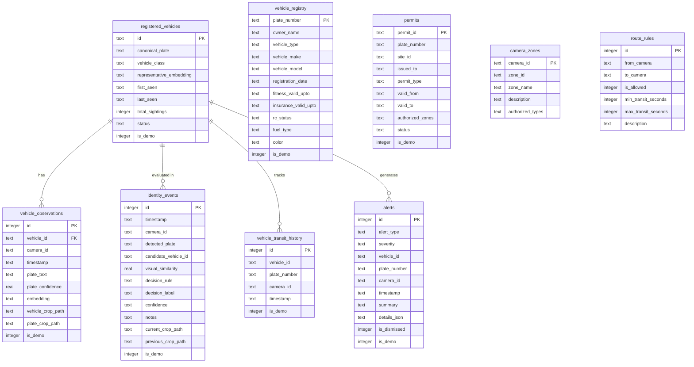

# IVACS V-TRACE: Final System Architecture

**Vehicle Trust, Route & Evidence Engine**  
**Problem Statement:** OD-08 — License Plate Detection and Recognition from Construction-Site CCTV Footage  
**Runtime Architecture:** Native Computer Vision + Deep Visual Embeddings + Deterministic Multi-Factor Trust Pipeline  
**Runtime Policy:** **Strict Zero LLM / Zero Generative AI at Runtime** (Deterministic, Explainable, Audit-Grade)

---

## 1. Executive Architecture Summary

IVACS V-TRACE is an edge-native, multi-camera intelligence system engineered specifically for high-risk industrial, construction, and critical infrastructure environments. Traditional Automatic Number Plate Recognition (ANPR) systems suffer catastrophic failure modes when encountering cloned plates, stolen plates mounted on different vehicles, obscured plates, or unauthorized route deviations.

IVACS V-TRACE decouples **License Plate Recognition** from **Physical Vehicle Verification**, coupling OCR with a **512-dimensional ResNet18 Vehicle Visual Fingerprint Engine**, a **Vehicle Registry Abstraction Layer**, a **Site Permit & Route Integrity Engine**, and an **Explainable Security Alert Engine**.

```
                           +-----------------------------------------------+
                           |          Construction-Site CCTV Feeds         |
                           |   CAM-01 (Entry) | CAM-02 (Batching Plant)    |
                           |   CAM-03 (Loading Area) | CAM-04 (Exit Gate)  |
                           +-----------------------------------------------+
                                                  |
                                                  v
                           +-----------------------------------------------+
                           |      Video Ingestion Layer (MP4/RTSP/Webcam)  |
                           |      Configurable Frame Stride & Decimation   |
                           +-----------------------------------------------+
                                                  |
                                                  v
                           +-----------------------------------------------+
                           |       Vehicle Detection (YOLOv8n - PyTorch)   |
                           |       Classes: car, truck, bus, motorcycle    |
                           +-----------------------------------------------+
                                                  |
                                                  v
                           +-----------------------------------------------+
                           |    Bumper-ROI Plate Localization (OpenCV)     |
                           |   Morphological Gradients + Geometric Filters |
                           +-----------------------------------------------+
                                                  |
                                                  v
                           +-----------------------------------------------+
                           |       Plate Text Recognition (EasyOCR)        |
                           |    IND Blue Strip Cropping + Slot Format      |
                           +-----------------------------------------------+
                                                  |
                                                  v
                           +-----------------------------------------------+
                           |   ResNet18 Deep Visual Fingerprint (512-D)    |
                           |      L2-Normalized Embedding Extraction       |
                           +-----------------------------------------------+
                                                  |
                                                  v
                           +-----------------------------------------------+
                           |   Deterministic Identity Decision Engine      |
                           |        Cosine Similarity & Rules A - E        |
                           +-----------------------------------------------+
                                                  |
                         +------------------------+------------------------+
                         |                                                 |
                         v                                                 v
+-----------------------------------+             +-----------------------------------+
|     Vehicle Registry Service      |             |    Site Context & Route Engine    |
| (Demo Registry / VAHAN Connector) |             |  (Permit Validation & Transits)   |
+-----------------------------------+             +-----------------------------------+
                         \                                                 /
                          \                                               /
                           +---------------------------------------------+
                           |       Security Alert Engine & Deduplication |
                           |       (10s Cooldown, Rules-Based Alerts)    |
                           +---------------------------------------------+
                                                  |
                                                  v
                           +---------------------------------------------+
                           |  Unified SQLite Persistence & Multi-Scale   |
                           |  Evidence Vault (data/evidence/...)         |
                           +---------------------------------------------+
                                                  |
                                                  v
                           +---------------------------------------------+
                           |  FastAPI Web Service (29 Endpoints + Docs)  |
                           +---------------------------------------------+
                                                  |
                                                  v
                           +---------------------------------------------+
                           |   React / Tailwind Command Center Dashboard |
                           | (4-CCTV Grid, KPI Bar, Alert Log, Scenarios)|
                           +---------------------------------------------+
```

---

## 2. Pipeline Subsystems

### 2.1 Video Ingestion Subsystem (`backend/video/`)
* **Sources Supported:** Local MP4 files, live RTSP network video streams, and USB/DirectShow webcams.
* **Frame Decimation:** Configurable frame stride (default: 5 frames) prevents inference queue saturation while maintaining vehicle transit tracking.
* **Metadata Normalization:** Extracts native timestamps, frame indices, resolution dimensions, and actual FPS.

### 2.2 Vehicle Detection Subsystem (`backend/detection/vehicle_detector.py`)
* **Backbone:** Ultralytics YOLOv8n (nano variant, PyTorch FP32/INT8).
* **Target Classes:** Filters exclusively for COCO classes `2` (car), `3` (motorcycle), `5` (bus), and `7` (truck).
* **Thresholding:** Confidence threshold $\ge 0.40$; Non-Maximum Suppression (NMS) IoU threshold $\ge 0.45$.
* **Crop Extraction:** Extracts tight vehicle bounding boxes with 5% contextual padding for embedding extraction.

### 2.3 License Plate Localization (`backend/detection/plate_detector.py`)
* **Bumper-ROI Strategy:** Rather than searching full 1080p frames, dynamically restricts plate localization to the bottom 45% of the detected vehicle bounding box.
* **Morphological Processing:** Applies grayscale conversion, Gaussian blur ($5 \times 5$), Sobel vertical edge gradient ($ksize=3$), Otsu thresholding, and morphological rectangular closing ($17 \times 3$).
* **Contour Filtering:** Isolates candidate bounding rectangles with aspect ratio $1.8 \le \text{AR} \le 5.5$ and minimum area $\ge 600\text{ px}^2$.

### 2.4 Optical Character Recognition (`backend/ocr/plate_ocr.py`)
* **Engine:** EasyOCR with PyTorch CPU/CUDA backend.
* **IND Blue Band Mitigation:** Crops out leftmost 12% of detected plate candidate to remove the Indian High Security Registration Plate (HSRP) blue circle/IND badge that degrades character models.
* **Slot Normalization:** Regex cleaning for Indian alphanumeric vehicle registration formats (`^[A-Z]{2}[0-9]{1,2}[A-Z]{0,3}[0-9]{4}$`).
* **Graceful Degradation:** Low-confidence OCR results ($\text{conf} < 0.35$) fall back to `UNREADABLE_PLATE` without breaking pipeline continuity.

### 2.5 Vehicle Visual Fingerprint Engine (`backend/vehicle_identity/`)
* **Backbone:** Pretrained PyTorch ResNet-18 (truncated before the 1000-class classification head).
* **Feature Representation:** Extracts output from Adaptive Average Pooling layer to produce a **512-dimensional continuous feature vector** $V \in \mathbb{R}^{512}$.
* **Normalization:** L2-normalization $\|V\|_2 = 1.0$ ensures cosine similarity reduces to simple dot product $\cos(\theta) = V_1 \cdot V_2$.
* **Similarity Clamping:** Cosine similarities are rigorously bounded to $[-1.0, 1.0]$.
* **Calibrated Similarity Threshold:**
  * $\text{Threshold} = 0.85$
  * Visual Match: $\text{Cosine Similarity} \ge 0.85$
  * Visual Mismatch: $\text{Cosine Similarity} < 0.85$ (Identical vehicle types typically yield $\ge 0.90$; differing vehicle classes yield $\le 0.35$).

### 2.6 Deterministic Identity Rules Engine (`backend/vehicle_identity/identity_rules.py`)
Deterministic classification enforces predictable, reproducible outcomes without non-deterministic hallucinations:

| Rule Code | Plate Observed | Visual Match ($\ge 0.85$) | Decision Output | Risk Level | Action Triggered |
|---|---|---|---|---|---|
| **Rule A** | Known Plate | **Yes** | `SAME_VEHICLE` | **LOW** | Consistent observation; update centroid |
| **Rule B** | Known Plate | **No** | `POSSIBLE_IDENTITY_MISMATCH` | **CRITICAL** | Security alert; prompt side-by-side evidence audit |
| **Rule C** | Different Plate | **Yes** | `POSSIBLE_PLATE_SWAP` | **HIGH** | Security alert; vehicle re-identified under false tag |
| **Rule D** | Unreadable | **Yes** | `PLATE_UNREADABLE_VEHICLE_MATCH` | **MEDIUM** | Visual tracking continuity preserved |
| **Rule E** | First Sighting | N/A | `NEW_VEHICLE` | **INFO** | Register new persistent vehicle identity |

### 2.7 Vehicle Registry Abstraction Layer (`backend/vehicle_registry/`)
* **Interface:** Abstract Base Class `VehicleRegistry` with asynchronous `get_vehicle(plate_number)` method.
* **Implementations:**
  * `DemoVehicleRegistry`: SQLite-backed persistent mock registry seeded with construction vehicles, classes, colors, fuel types, and registration validity.
  * `VahanVehicleRegistry`: Architectural stub ready for authorized Government of India Ministry of Road Transport and Highways (MoRTH) Parivahan/VAHAN API integration via OAuth2/HMAC.
* **Consistency Check Logic:**
  * Compares CCTV detected class (`car`, `truck`, `bus`, `motorcycle`) against official registration.
  * Resolves semantic aliases (e.g. `"heavy goods vehicle"` $\leftrightarrow$ `"truck"`, `"tipper"` $\leftrightarrow$ `"truck"`, `"bus"` $\leftrightarrow$ `"bus"`).
  * Emits `REGISTRY_MATCH`, `REGISTRY_ATTRIBUTE_MISMATCH`, or `NOT_FOUND`.

### 2.8 Construction Site Access & Route Integrity (`backend/site_context/`)
* **Zone Geometry:** Configured 4 camera zones:
  * `CAM-01`: Zone A (Main Site Entrance Gate)
  * `CAM-02`: Zone B (Batching & Concrete Mixing Plant)
  * `CAM-03`: Zone C (Heavy Excavation & Loading Area)
  * `CAM-04`: Zone D (Material Exit Gate & Weighbridge)
* **Permit Management:** Evaluates vehicle plate against site permit database for status (`ACTIVE`, `EXPIRED`, `SUSPENDED`), date bounds, and authorized zone lists.
* **Route Integrity & Anomaly Detection:**
  * Tracks vehicle transitions between cameras with timestamps.
  * **Impossible Transitions:** Direct transition between non-contiguous zones (e.g. `Zone A` $\to$ `Zone C` without passing through `Zone B`).
  * **Speed/Transit Violations:** Flag transits that occur faster than the physical minimum traversal time (e.g. 2s actual vs 30s minimum permitted).

### 2.9 Security Alert Engine & Deduplication (`backend/alerts/`)
* **Deduplication Strategy:** State-machine keyed on `(vehicle_id, alert_type)`. Enforces a strict **10-second temporal cooldown** window to prevent alert log flooding from 30 FPS camera feeds.
* **Alert Severity Taxonomy:**
  * `CRITICAL`: Visual identity mismatch (cloned plate), unauthorized vehicle entering active zone.
  * `HIGH`: Plate swap detected, expired permit entry attempt.
  * `MEDIUM`: Route anomaly (impossible transition, speed violation), unreadable plate on commercial transport.
  * `LOW` / `INFO`: Normal transit, new vehicle registration.
* **Vehicle Trust Snapshot:** Synthesizes multi-factor telemetry into a transparent score $[0, 100]$:
  $$\text{Trust Score} = \text{Base}(100) - \text{Penalties}(\text{Mismatch: } 50, \text{No Permit: } 30, \text{Route Anomaly: } 25, \dots)$$

---

## 3. Database Schema (SQLite)

The system persists all audit data in a lightweight, zero-configuration relational SQLite database (`vtrace.db`):



---

## 4. REST API Taxonomy (29 Endpoints)

### Core System & Cameras
* `GET /api/health` — System status, active device (CPU/CUDA), initialized models.
* `GET /api/cameras` — Configured CCTV camera sources (`CAM-01` through `CAM-04`).
* `GET /api/cameras/{id}/stream` — MJPEG streaming video feed for live grid monitor.
* `GET /api/media` — Universal local evidence file streaming (supports absolute & relative paths).
* `GET /evidence/{filename}` — Static evidence asset retrieval.

### Executive Dashboard & Live Cards
* `GET /api/dashboard/summary` — Aggregate metrics: active alerts, total vehicles, critical mismatches, fleet trust index.
* `GET /api/dashboard/live` — Real-time live status for 4 camera cards: last plate, speed, route status, permit status.

### Detections & Video Processing
* `POST /api/process-video` — Ingests video file or stream URL through detection and OCR pipeline.
* `GET /api/detections` — Paginated detection events with bounding boxes and OCR confidence.
* `GET /api/detections/{id}` — Single detection event detail with evidence crops.

### Vehicle Identity & Visual Fingerprint
* `GET /api/vehicles` — Catalog of all registered vehicle entities and visit counts.
* `GET /api/vehicles/{id}` — Vehicle profile with observation history and embedding centroids.
* `GET /api/vehicles/{id}/comparison` — Side-by-side evidence pair comparing current sighting against historical reference.
* `GET /api/vehicles/{id}/trust-snapshot` — Multi-factor trust evaluation, visual similarity score, permit check, and route integrity.
* `GET /api/identity-events` — Chronological feed of visual identity match events and rules applied.
* `GET /api/identity-events/{id}` — Detailed identity observation with full audit notes.

### Security Alert Engine
* `GET /api/alerts` — Query security alerts filtered by `severity`, `camera_id`, `dismissed` state, or pagination.
* `GET /api/alerts/{id}` — Detailed alert breakdown with evidence paths and rule triggers.
* `POST /api/alerts/{id}/dismiss` — Operator alert acknowledgement and dismissal.

### Vehicle Registry Subsystem
* `GET /api/registry/vehicle/{plate}` — Vehicle registration records (RTO/VAHAN mock specification).
* `POST /api/demo/registry/reset` — Reset demo registry table to factory state.

### Construction Site Context & Permits
* `GET /api/permits` — All active and historical site access permits.
* `GET /api/permits/{plate}` — Permits associated with a specific vehicle plate.
* `GET /api/site/zones` — Camera-to-zone spatial topological mapping.
* `GET /api/site/routes` — Directed graph of permitted transitions and traversal durations.

### Controlled Demo State Machine
* `POST /api/demo/scenario/start` — Launch one of 4 controlled scenarios (`NORMAL_REPEAT`, `IDENTITY_MISMATCH`, `PLATE_SWAP`, `PLATE_UNREADABLE`).
* `POST /api/demo/scenario/stop` — Graceful scenario termination.
* `GET /api/demo/scenario/status` — Live status: step counter, active scenario, latest decision, similarity score.
* `POST /api/demo/reset` — Purges demo records (`is_demo=1`) while preserving all persistent architecture.

---

## 5. Frontend Command Center Architecture (`frontend/`)

The user interface is built as a single-page application using **React 18**, **Vite**, and **Tailwind CSS**. It is statically built into `frontend/dist/` and served directly by FastAPI at `/` for zero-friction single-command startup.

### Key UI Components:
1. **Executive KPI Header:** Real-time counters for Active Cameras, Total Sightings, Critical Mismatches, Active Security Alerts, and Overall Fleet Trust Index.
2. **4-CCTV Live Surveillance Grid:** 
   - 4 live camera cards (`CAM-01` to `CAM-04`) showing stream preview, active vehicle, detected plate, zone name, permit status pill, and route state.
3. **Interactive Scenario Launcher Bar:**
   - 1-click scenario triggers: Normal Repeat, Identity Mismatch, Plate Swap, Unreadable Plate.
   - Live scenario status badge, active step indicator, and "Purge Demo State" button.
4. **Real-Time Security Alert Stream:**
   - Color-coded alert cards (Critical / High / Medium / Low) with timestamp, camera, plate, description, and "Inspect Evidence" button.
5. **Side-by-Side Visual Evidence Modal:**
   - Renders current vehicle & plate crop beside historical registered vehicle & plate crop.
   - Highlights mathematical cosine similarity and human-readable explanation of why Rule B or Rule C was triggered.
6. **Vehicle Trust & Audit Drawer:**
   - Comprehensive breakdown: Visual Consistency (%), Registry Check (Model/Color), Permit Validity (Active/Expired), Route History (Transits), and Deduplicated Alert Logs.
7. **Demo Vehicle Registry Inspector Modal:**
   - Searchable view of seeded demo database records, vehicle classes, owners, and permit statuses.
